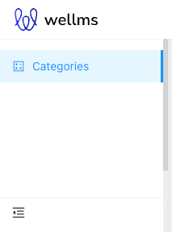
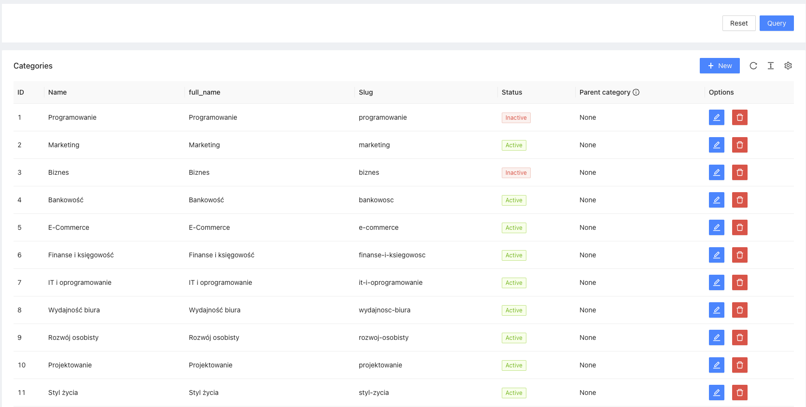
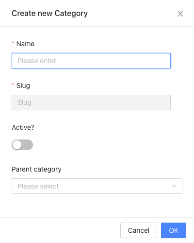

# Categories

[](https://escolalms.github.io/Categories/)
[](https://codecov.io/gh/EscolaLMS/Categories)
[](https://github.com/EscolaLMS/Categories/actions/workflows/test.yml)
[](https://packagist.org/packages/escolalms/categories)
[](https://packagist.org/packages/escolalms/categories)
[](https://packagist.org/packages/escolalms/categories)
[](https://codeclimate.com/github/EscolaLMS/Categories/maintainability)

## What does it do

This package is used for creating Categories for EscolaLms.

## Installing

- `composer require escolalms/categories`
- `php artisan migrate`
- `php artisan db:seed --class="EscolaLms\Consultations\Database\Seeders\ConsultationsPermissionSeeder"`

## Endpoints

All the endpoints are defined in [](https://escolalms.github.io/Categories/)

## Tests

Run `./vendor/bin/phpunit --filter 'EscolaLms\\Categories\\Tests'` to run tests. See [tests](tests) folder as it's quite good staring point as documentation appendix.

### Admin panel

**Left menu**



**List of consultations**



**Creating/editing consultation**



## Permissions

Permissions are defined in [seeder](vendor/escolalms/categories/database/seeders/CategoriesPermissionSeeder.php)

## Features

The lib allows categories

- adding a category
- generate slug for category
- edit category
- delete category
- show list categories
- if you want to remove category which has sub categories, earlier delete sub categories

To play the content you can use [EscolaLMS Categories](https://github.com/EscolaLMS/Categories)

### Seeder

You can seed library and content with build-in seeders that are accessible with

- `php artisan category-permissions:seed` to add permissions
- `php artisan db:seed --class="\EscolaLms\Categories\Database\Seeders\CategoriesSeeder"`

1. `Parent` Category is related belong to with other category
2. `Children` Category is related has many with other categories
3. `Courses` Category belongs to many with models Course
4. `Users` Category is related belongs to many with User
```
Category 1 -> 1 Category (Parent)
Category 1 -> n Category (Children)
Category 1 -> n Course
Category 1 -> n Users
```
