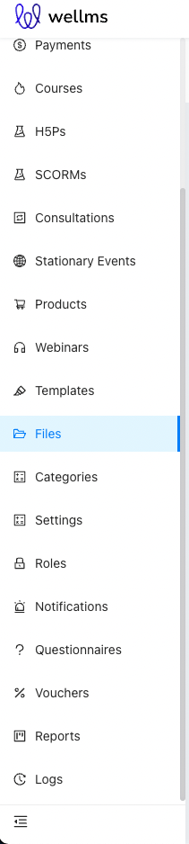
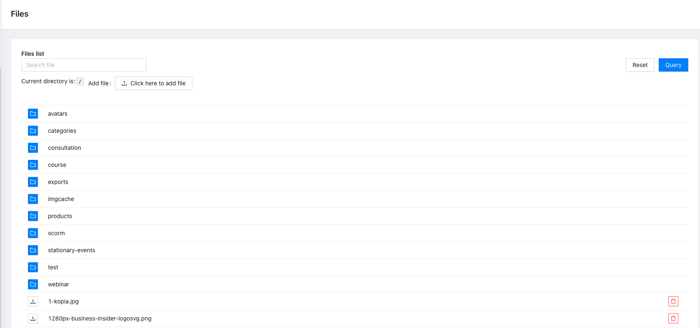
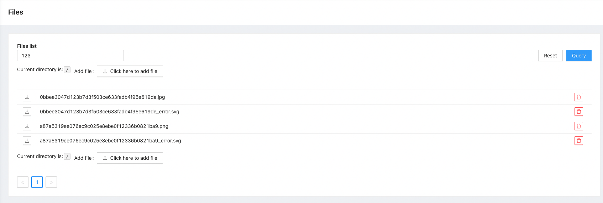
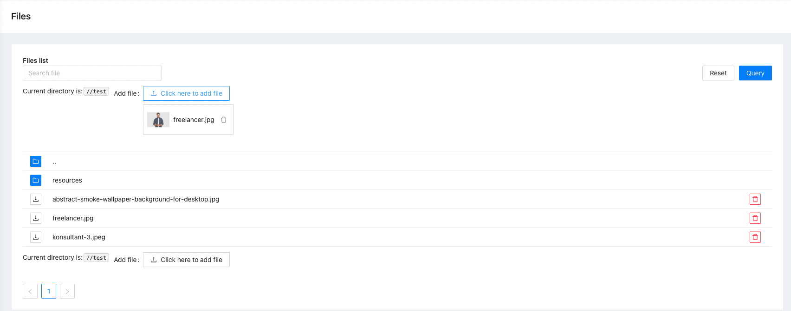

# Files 

Files browser package

## What does it do

This package is used to upload, delete and reuse files.

## Installing

- `composer require escolalms/files`
- `php artisan migrate`
- `php artisan db:seed --class="EscolaLms\Files\Database\Seeders\PermissionTableSeeder"`

## Database

This package adds `access_to_directories` column to the users table. 

## Endpoints

All the endpoints are defined in 

## Tests

Run `./vendor/bin/phpunit` to run tests.

## Events

This package does not dispatch any events.

## Listeners

This package listens for events and adds or removes user access to directories.

- `EscolaLms\Auth\Events\AccountConfirmed` - add user access to directory `avatars/{user_id}`

- `EscolaLms\Courses\Events\CourseTutorAssigned` - add user access to directory `course/{course_id}`
- `EscolaLms\Courses\Events\CourseTutorUnassigned` - remove user access to directory `course/{course_id}`

- `EscolaLms\Webinar\Events\WebinarTrainerAssigned` - add user access to directory `webinar/{webinar_id}`
- `EscolaLms\Webinar\Events\WebinarTrainerUnassigned` - remove user access to directory `webinar/{webinar_id}`

- `EscolaLms\StationaryEvents\Events\StationaryEventAuthorAssigned` - add user access to directory `stationary-events/{stationary_evet_id}`
- `EscolaLms\StationaryEvents\Events\StationaryEventAuthorUnassigned` - remove user access to directory `stationary-events/{stationary_evet_id}`

## How to use this on frontend

### Admin panel

**Left menu**

**Files browser**

**File finder**

**Upload the file to the selected directory**

## Permissions

Permissions are defined in [seeder](database/seeders/PermissionTableSeeder.php)
